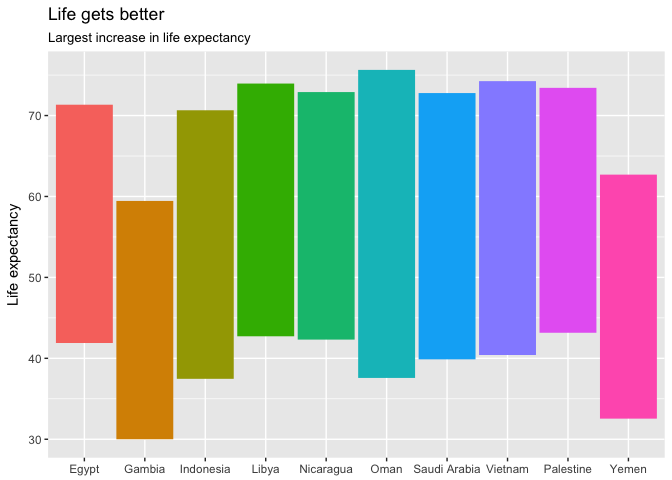

`countries`
================

<!-- README.md is generated from README.Rmd. Please edit that file -->
`countries` offers a consistent framework for working with country names and codes, with functions for parsing irregular country names and converting codes and names in many languages and formats.

Installation
------------

Install from GitHub with

``` r
# install.packages("devtools")
devtools::install_github("alistaire47/countries")
```

------------------------------------------------------------------------

A painless country name and code workflow
=========================================

Working with country data can be frustrating. Even with well-curated data like [`gapminder`](https://github.com/jennybc/gapminder), there are some oddities:

``` r
library(countries)
library(gapminder)
library(tidyverse)    # Works equally well in any grammar.

grep('Korea', unique(gapminder$country), value = TRUE)
#> [1] "Korea, Dem. Rep." "Korea, Rep."
grep('Yemen', unique(gapminder$country), value = TRUE)
#> [1] "Yemen, Rep."
```

`countries` offers a framework for working with country names and codes without manually editing data or scraping codes from Wikipedia.

1. Standardize
--------------

If data has non-standardized names, standardize them to an ISO 3166-1 code or other standardized code or name with `parse_country`:

``` r
gap <- gapminder %>% 
    # standardize to ISO 3166 Alpha-2 code
    mutate(country_code = parse_country(country))

gap %>%
    select(country, country_code, year, lifeExp) %>%
    sample_n(10)
#> # A tibble: 10 × 4
#>       country country_code  year lifeExp
#>        <fctr>       <fctr> <int>   <dbl>
#> 1        Mali           ML  1967  38.487
#> 2       Japan           JP  2007  82.603
#> 3        Oman           OM  1962  43.165
#> 4    Botswana           BW  1997  52.556
#> 5        Mali           ML  1982  43.916
#> 6     Hungary           HU  2007  73.338
#> 7       Libya           LY  1987  66.234
#> 8  Bangladesh           BD  1987  52.819
#> 9       Benin           BJ  2002  54.406
#> 10  Guatemala           GT  1987  60.782
```

2. Convert
----------

If data comes with countries already coded, convert them with `as_country_code()`:

``` r
# 2016 Olympic gold medal data
olympics <- read_tsv('https://raw.githubusercontent.com/nbremer/olympicfeathers/gh-pages/data/raw%20medal%20data/Rio%202016%20gold%20medal%20winners.txt')

olympics %>% count(country = as_country_code(NOC, from = 'ioc'), sort = TRUE)
#> # A tibble: 59 × 2
#>    country     n
#>      <chr> <int>
#> 1       US    46
#> 2       GB    28
#> 3       CN    26
#> 4       RU    19
#> 5       DE    18
#> 6       JP    12
#> 7       FR    11
#> 8       KR     9
#> 9       AU     8
#> 10      HU     8
#> # ... with 49 more rows
```

or to convert to country names, use `as_country_name()`:

``` r
olympics %>% 
    count(country = as_country_name(NOC, from = 'ioc'), 
          Event_gender) %>% 
    spread(Event_gender, n) %>% 
    arrange(desc(W))
#> # A tibble: 59 × 4
#>        country     M     W     X
#>          <chr> <int> <int> <int>
#> 1           US    17    27     2
#> 2        China    12    14    NA
#> 3       Russia     9    10    NA
#> 4      Hungary     1     7    NA
#> 5        Japan     5     7    NA
#> 6           UK    19     7     2
#> 7  Netherlands     2     6    NA
#> 8    Australia     3     5    NA
#> 9      Germany    10     5     3
#> 10 South Korea     4     5    NA
#> # ... with 49 more rows
```

or translate to another language:

``` r
olympics$NOC %>% unique() %>% 
    as_country_name(from = 'ioc', to = 'ja') %>% 
    head(10)
#>  [1] "中国"           "英国"           "アメリカ"       "ハンガリー"    
#>  [5] "スウェーデン"   "カナダ"         "オランダ"       "日本"          
#>  [9] "スペイン"       "オーストラリア"
```

3. Format
---------

A particularly common hangup with country data is presentation. While "Yemen, Rep." may be fine for exploratory work, to create a plot to share, such names need to be changed to something more palatable either by editing the data or manually overriding the labels directly on the plot.

If the existing format is already standardized, `countries` offers another option: use a formatter function created with `format_country`, just like for thousands separators or currency formatting:

``` r
gap %>% 
    group_by(country_code) %>% 
    summarise(start_life_exp = lifeExp[which.min(year)], 
              stop_life_exp = lifeExp[which.max(year)], 
              diff_life_exp = stop_life_exp - start_life_exp) %>% 
    top_n(10, diff_life_exp) %>%
               # Plot country codes...
    ggplot(aes(x = country_code,
               ymin = start_life_exp, 
               ymax = stop_life_exp, 
               colour = country_code)) + 
    geom_linerange(size = 20, show.legend = FALSE) + 
                     # ...just pass `labels` a formatter function!
    scale_x_discrete(labels = format_country()) + 
    labs(title = 'Life gets better',
         subtitle = 'Largest increase in life expectancy',
         x = NULL, y = 'Life expectancy')
```



------------------------------------------------------------------------

Data
----

The data underlying `countries` comes from a number of sources, including

-   [The Unicode Common Locale Data Repository (CLDR) Project](http://cldr.unicode.org/) supplies country names in many, many languages, from Afrikaans to Zulu. Even better, [CLRDR aspires to use the most customary name](http://cldr.unicode.org/translation/country-names) instead of formal or official ones, e.g. "Switzerland" instead of "Swiss Confederation". See included LICENSE for terms of use.
-   [The CIA World Factbook](https://www.cia.gov/library/publications/the-world-factbook/index.html) supplies a standardized set of names and codes.
-   [The National Geospatial-Intelligence Agency (NGA)](http://geonames.nga.mil/gns/html/countrycodes.html) is the organization responsible for standardizing US government use of country codes. It inherited the now-deprecated FIPS 10-4 from NIST, which it turned into the GEC, which is now also deprecated in favor of GENC, a US government profile of ISO 3166.
-   Yes, [Wikipedia](https://en.wikipedia.org/wiki/Category:Lists_of_country_codes) offers a rich set of country codes, if aggregated into a useful format.
-   [Open Knowledge International's Frictionless Data](http://data.okfn.org/data/core/country-codes) supplies a set of codes collated from a number of sources.
-   The regex powering `parse_country()` are from [`countrycode`](https://github.com/vincentarelbundock/countrycode). If you would like to improve both packages, please contribute there!

License
-------

`countries` is licenced as open-source software under [GPL-3](https://www.gnu.org/licenses/gpl.html).
